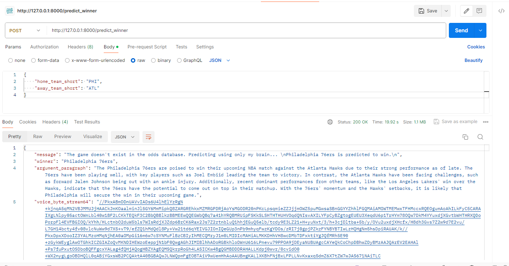
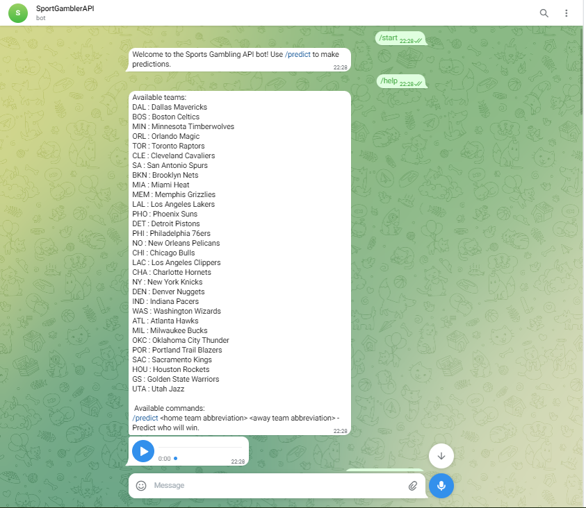
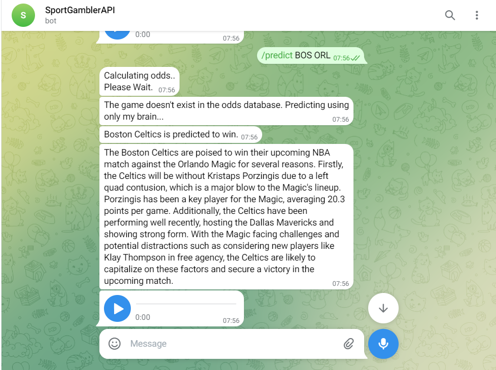

# NBA Predictor Bot

NBA Predictor Bot is an API built in Python using FastAPI and available as a Telegram bot. It predicts the outcome of upcoming NBA matches using machine learning models - Logistic Regression and external APIs.



### Telegram Bot
<div style="display: flex;">
  
  
</div>


## Features

- **Prediction Endpoint:** Access the /predict_winner endpoint to get a prediction for the winner of an upcoming NBA match.
- **Integration:** Utilizes SportsDataIO, The-Odds-API, and NewsAPI for data.
- **Explanation Generation:** Provides detailed explanations for predictions using OpenAI's ChatGPT.
- **Text-to-Speech:** Generates audio recordings of explanations.
- **Redis Cache:** Optimizes resource usage with caching.

## Usage

1. **Setting API Keys:**
   Add your API keys to `api_settings.py`.
   - ODDS_API_KEY
   - TELEGRAM_BOT_TOKEN
   - SPORTS_DATA_API_KEY
   - AZURE_REDIS_PASS, REDIS_HOST, REDIS_PORT
   - OPENAI_KEY
   - NEWS_API_KEY

2. **Building with Docker:**
    ```bash
    docker build -t nba-predictor-bot .
    ```

3. **Running with Docker:**
    ```bash
    docker run -p 8000:8000 nba-predictor-bot
    ```

4. **Accessing the Bot:**
   Interact with the NBA Predictor Bot via the Telegram bot or the API.

## Contributors

- Aviel Nisanov - Avielnis222@gmail.com
- Roee Lapushin - Rlapushin@gmail.com
